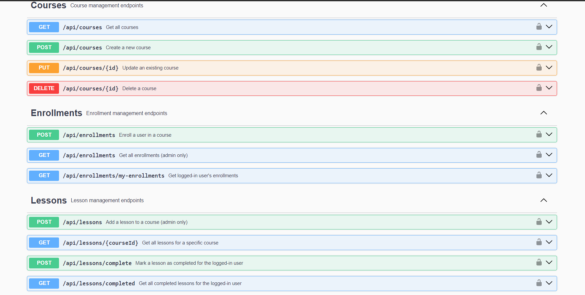

# Online Learning Platform

## Expense Swagger UI

   
     
    
      
    

## Project Overview

An Online Learning Platform is a web application designed to facilitate user enrollment in courses, lesson tracking, and progress management. It enables administrators to manage courses and lessons while providing users with the ability to enroll, complete lessons, and track their progress.

## Features

- User authentication with JWT
- Admin-only course CRUD operations
- User enrollment in courses
- Lesson completion tracking
- Progress tracking for users
- Secure endpoints with role-based access control
- Interactive API documentation using Swagger

## Technologies Used

- **Backend**: Node.js, Express.js
- **Database**: MongoDB
- **Authentication**: JWT (JSON Web Tokens)
- **Documentation**: Swagger
- **Others**: Mongoose, bcryptjs

## Installation

To get started with the Course Management System, follow these steps:

## Start the server : npm start

1. **Clone the repository:**

   git clone <https://github.com/yourusername/online_learning_platform.git>

2. Live URL : https://online-learning-platform-4u8s.onrender.com
